# M4.2 UI Screen Flow Map

## Purpose

This document maps the visible AvalaOS Core App shell and golden-path screens as audited in M4.2. It records what is present, what is hidden or deferred, and where current navigation behavior can affect the intended buyer-demo path.

This is an architecture audit document only. It does not change UI, code, mock data, routing, scoring, schema, provider behavior, or Health.

## Source-Of-Truth Product Flow

```mermaid
flowchart LR
  Org["Organization / Setup"]
  Catalog["Process Catalog"]
  Detail["Process Detail"]
  Assessment["Guided Assessment"]
  Decision["Decision Pack"]
  Govern["Govern Lite Controls"]
  Studio["Avala Studio / Docs Forge"]
  Docs["Generated Docs"]
  Import["Docs-to-Delivery Import"]
  Work["Delivery Work Items"]
  Pack["Delivery Pack"]
  Monitor["Monitor Dashboard"]

  Org --> Catalog --> Detail --> Assessment --> Decision --> Govern --> Studio --> Docs --> Import --> Work --> Pack --> Monitor
```

## App Shell Map

| Shell area | Current role | Source components | Audit result |
| --- | --- | --- | --- |
| Sidebar | Primary module and view navigation with guard metadata filtering. | `components/shared/Sidebar.tsx` | Aligned to central guard metadata; hides deferred and denied views; Admin remains a direct organization-scope action. |
| ModuleJourney | High-level module journey strip across Assess, Studio, Delivery Lite, and Monitor. | `components/shared/ModuleJourney.tsx` | Aligned to central guard metadata; visible modules are guard-filtered and disabled when scope is invalid. |
| Header | Scope switcher, user controls, and primary action. | `components/shared/Header.tsx` | Primary action can prioritize Studio before Assess when Docs is enabled; needs AP demo-flow decision. |
| Scope switcher | My Work, Team, and Project scope selection. | `components/shared/ScopeSwitcher.tsx` | Organization scope is not a normal switcher option; Admin uses a separate Sidebar action. |
| App guard integration | Guarded view/scope application and persisted-state cleanup. | `App.tsx`, `services/viewAccessGuard.ts`, `services/viewStatePersistence.ts` | M4.1d guard path is active for App transitions, Sidebar/Journey metadata, and persisted stale-state cleanup. |

## View And Module Map

| Module | Main visible views | Current status | Notes |
| --- | --- | --- | --- |
| Organization/Admin | Organization setup via organization-scope Workspace behavior. | Present, AP-decisioned | Admin and Workspace semantics remain combined pending AP decision. |
| Assess | Process Catalog, Template Library, Process Detail, Guided Assessment. | Present | Core Assess path is visible and guarded. |
| Studio / Docs | Docs Forge, Template Studio, Document Repository, Generated Artifacts review. | Present | Source context handoff is visible when entered from Assess. |
| Delivery Lite | Boards, list, backlog, roadmap, timeline, capacity, sprints, Delivery Pack, timesheets, automations. | Present with advanced surfaces | Core work item and Delivery Pack path exists; some advanced surfaces are outside first demo path. |
| Monitor | Dashboard and Portfolio. | Present | Dashboard includes handoff ledger and disabled AI Insights widget. |
| Reports | Reports placeholder. | Deferred | Hidden by guard metadata; route handling remains future work. |
| Teams | Team view. | Decision pending | Team scope support exists, but route semantics remain AP-decisioned. |

## Golden Path Screen Map

| Step | View/scope | Component | Present? | Entry | Exit / handoff | Audit note |
| --- | --- | --- | --- | --- | --- | --- |
| Organization / setup | Organization scope, Workspace behavior | `OrganizationSetupView` | Yes | Admin Sidebar action or org setup flow | Process Catalog after module/setup readiness | Contains useful setup controls, but also demo-risk `Upgrade to Premium` and `Coming Soon` controls. |
| Process Catalog | Assess module | `ProcessCatalogView` | Yes | Sidebar, ModuleJourney, Header if Assess selected | Process Detail | Empty and loading states exist; catalog needs canonical process data for demo. |
| Process Detail | Assess process | `ProcessDetailStubView` | Yes | Process Catalog process click | Guided Assessment or Studio handoff | Decision Pack and Govern Lite summaries are present. Handoff button label is narrower than full artifact set. |
| Guided Assessment | Assess process | `GuidedAssessmentView` | Yes | Process Detail `Start Assessment` / `Resume Assessment` | Process Detail / status actions | Rich assessment UI exists; scoring CTA wording should be reviewed before buyer demo. |
| Decision Pack | Process Detail panel and assessment export actions | `decisionPackRenderModel`, `ProcessDetailStubView`, `GuidedAssessmentView` | Yes | Assessment scoring result | Studio handoff | Contract-safe rendering exists; canonical data should show deterministic score and human-review path clearly. |
| Govern Lite card | Process Detail | `AvalaGovernLiteCardPanel` | Yes | Scored process | Studio handoff | Strong control copy; no execution or external-system action implied. |
| Avala Studio / Docs Forge | Docs module, My Work/Team/Project scope | `DocsForgeView`, `LandingPage` | Yes | Sidebar, ModuleJourney, Header, Assess handoff | Generated Artifacts review | Assess source context card is visible and read-only. Standalone generation needs buyer-safe labeling. |
| Generated Docs | Project docs or generated artifacts review | `DocsView`, `WorkspaceView` | Yes | Docs Forge completion or Document Vault | Import Work Items | Docs empty state has stale `AI Workspace` wording. |
| Docs-to-Delivery import | Generated Artifacts work item panel | `WorkspaceView`, `ImportWorkItemsModal` | Yes | Generated Artifacts panel | Delivery backlog/work items | Lineage summary appears before modal; modal should restate lineage before paid pilot. |
| Delivery work items | Delivery module | `ProjectView`, `MyWorkView`, `TeamView` | Yes | Import result or Delivery nav | Delivery Pack | Basic work item surfaces exist; canonical data needed for coherent demo. |
| Delivery Pack | Delivery project scope | `DeliveryPackView` | Yes | Sidebar / Delivery nav | Export or dashboard | Lineage/incomplete status is visible, but export policy remains M4.1g scope. |
| Monitor dashboard | Monitor module | `CustomDashboardView` | Yes | Sidebar, Header fallback, guard fallback | Handoff ledger / widgets | Handoff ledger helps demo continuity; AI Insights widget is disabled with generic error surface. |

## Guard Behavior Map

| Scenario | Current behavior | Buyer-demo impact |
| --- | --- | --- |
| Auth or organization loading | Waits instead of redirecting. | Safe; avoids flicker from loading state. |
| Unknown persisted view | Normalizes and resolves through the guard. | Safe; prevents stale route confusion. |
| Malformed persisted scope | Normalizes and resolves through the guard. | Safe; prevents malformed startup state. |
| Disabled module | Guard denies and Sidebar/Journey hide or disable entries. | Safe; supports module-specific demos. |
| Invalid scope for a view | Guard denies with fallback; Sidebar/Journey disable where applicable. | Mostly safe; fallback messages should be demo-reviewed. |
| Missing permission | Guard denies; Admin role bypass or any one listed permission remains first implementation default. | Safe for current permissions model; long-term semantics remain AP-decisioned. |
| Reports route | Deferred in guard metadata. | Should stay hidden unless AP approves placeholder handling. |
| Teams route | Decision-pending in guard metadata. | Should stay hidden or controlled until AP resolves Teams semantics. |
| Admin / Workspace path | Preserved through organization-scope Workspace behavior. | Usable for internal admin review; needs AP decision before buyer-demo narrative. |

## Non-Sidebar Entry Point Map

| Entry point | Current guard alignment | Audit result |
| --- | --- | --- |
| Header primary action | Uses guarded target candidates in App. | Guarded, but module priority can skip Assess and jump to Studio. |
| Project selector / Docs Forge entry | Selects project then opens Docs Forge. | Guarded by App transition path; copy still says `AI Assistant`. |
| Assess-to-Studio handoff | Normalizes Docs Forge scope, preserves valid source context, clears on denial. | Guard behavior is safe and understandable when source context card appears. |
| ModuleJourney | Uses shared guard metadata. | Aligned with Sidebar after M4.1d-3. |
| Persisted current view/scope restore | Normalized through view-state persistence helper. | Safe after M4.1d-4. |
| Direct set-current-view handlers | Centralized through guarded App helpers where integrated. | Safer than baseline; future UI fix pass should avoid adding unguarded direct entries. |
| App fallback effects | Resolve through guard and persistence cleanup after loading. | Safe; fallback copy can be demo-reviewed. |

## Hidden, Deferred, And Dead-State Map

| Area | Current state | Classification |
| --- | --- | --- |
| Reports | Deferred by guard; placeholder component exists. | Needs AP product decision. |
| Teams | Decision-pending by guard; team view exists for eligible state. | Needs AP product decision. |
| AI Controls | Controls visible in Studio form and organization setup, but no dedicated Admin route. | Needs AP product decision. |
| Admin | Admin action opens organization-scope Workspace behavior. | Needs AP product decision. |
| Workspace without generation data | Shows a recovery message back to docs repository. | Can wait if not in demo path; should be scripted around. |
| Project/Team unsupported view fallback | Shows generic unavailable/not implemented messages. | Can wait unless AP chooses deferred route handling first. |

## Data Dependency Map

| Screen | Needs canonical demo data? | Why |
| --- | --- | --- |
| Organization setup | Yes | Modules, roles, and company profile should match buyer-demo story. |
| Process Catalog | Yes | Needs a coherent process list with enterprise-ready scoring context. |
| Process Detail | Yes | Needs scored and unscored examples with Decision Pack and Govern Lite states. |
| Guided Assessment | Yes | Needs filled answers, evidence, assumptions, and reviewer state. |
| Docs Forge | Yes | Needs source context from the selected scored process. |
| Generated Artifacts | Yes | Needs generated artifact set and work items matching the process. |
| Delivery work items | Yes | Needs imported work items with lineage and status. |
| Delivery Pack | Yes | Needs lineage-complete and incomplete examples depending on AP demo script. |
| Monitor dashboard | Yes | Needs ledger and value widgets to show continuity. |

## Architecture Recommendation

Do not implement canonical demo data until the visible UI fix pass removes stale labels and buyer-demo misleading states. The guard architecture is strong enough for the golden path, but the visible screen language is not yet clean enough for external demo.

Recommended next milestone: `M4.2a Buyer-Demo UI Copy And Empty-State Fix Pass`.
