# M4.2b Canonical Demo Data Map

## Scope

This map supports the M4.2b planning milestone. It does not change data or code.

Canonical scenario:

`AP Invoice Exception Handling / AP Invoice Exception Workflow`

Target entity path:

Organization -> Users/Roles -> Process -> Assessment -> Decision Pack -> Govern Lite -> Studio -> Generated Docs -> Work Items -> Delivery Tasks -> Delivery Pack -> Monitor.

## Current Data Map By File And Module

| Module | Current file or service | Current data role | Planning note |
| --- | --- | --- | --- |
| Auth/login | `data/mockData.ts`, `authAdapter.ts` | Mock users and login profiles; local demo current user persistence. | Retarget to AP canonical personas. |
| Organization | `orgAdapter.ts`, `OrganizationProvider` | Local mock org `Acme Global Operations`; enabled modules stored through adapter settings. | Replace org name/profile after AP decision. |
| View/RBAC guard | `viewAccessGuard.ts`, `viewStatePersistence.ts`, `App.tsx` | Central guard metadata plus persisted view/scope cleanup. | Canonical users must have exact permissions for intended path. |
| Assess process | `MOCK_ASSESS_PROCESSES`, `assessAdapter.ts`, `processService.ts` | Five process fixtures plus memory/Supabase adapter. | Replace buyer-visible processes with AP Invoice Exception Handling. |
| Assessment | `assessAdapter.ts`, `assessmentService.ts`, `scoringEngine.ts` | Demo assessments built from response fixtures and deterministic scores for completed processes. | Seed one AP assessment with complete inputs/evidence/assumptions. |
| Decision/Handoff Pack | `scoringEngine.ts`, `assessToStudioHandoff.ts` | Deterministic output and compact source-context payload. | Preserve contracts; populate AP handoff payload through canonical assessment. |
| Govern Lite | `avalaGovernLiteService.ts` | Derived governance card from process, assessment, evidence, risk, and HITL signals. | Tune AP evidence and risk inputs without formula changes. |
| Docs templates | `data/docTemplates.ts`, `templateService.ts` | BRD/PDD/FRD/SDD/ADD/charter templates and industry profiles. | Keep only templates needed for AP buyer path; archive or hide broad examples later if AP approves. |
| Generated docs | `MOCK_DOCUMENT_GENERATIONS`, `docsAdapter.ts`, `DocsProvider` | Multiple document generations across unrelated scenarios. | Replace with one AP generated document pack carrying Assess sourceContext. |
| Delivery data | `MOCK_PROJECTS`, `MOCK_EPICS`, `MOCK_SPRINTS`, `MOCK_TASKS`, `deliveryAdapter.ts`, `DeliveryProvider` | Five projects, many epics/tasks, mixed lineage. | Replace buyer-visible delivery data with AP delivery work items. |
| Source lineage | `docsToDeliveryLineage.ts`, `Task.sourceLineage`, `deliveryAdapter.ts` metadata | Runtime imports can attach lineage; current static complete lineage lives in month-end close tasks. | Port complete lineage to AP canonical tasks. |
| Handoff ledger | `handoffLedgerService.ts`, `handoffLedgerAdapter.ts` | Runtime handoff entries; local fallback storage. | Seed or generate AP Assess-to-Studio and Docs-to-Delivery handoff entries. |
| Delivery Pack | `deliveryPackService.ts` | Derived from project, tasks, users, document generations, process, assessment, and handoff entries. | Ensure AP pack resolves to review-ready or intentional review-needed state. |
| Monitor/dashboard | `CustomDashboardView`, `PortfolioView`, delivery data | Derived task/project/sprint/handoff views; no standalone canonical monitor seed. | Make AP project/tasks/handoff drive monitor summary. |

## Proposed Canonical Data Map By Module

| Module | Canonical entity | Required fixture characteristics |
| --- | --- | --- |
| Organization | AP-approved demo org, recommended placeholder `Northstar Shared Services` | Finance shared-services profile, all four modules enabled. |
| Users/Roles | Admin, Process Owner, Reviewer, Delivery Lead, Contributor, Buyer/Viewer | Minimal personas with clear default scopes/views and exact permissions. |
| Assess | `AP Invoice Exception Handling` process | Completed or approved process; finance department; high criticality; owner Priya Nair or AP-approved owner. |
| Guided Assessment | `assess-proc-ap-invoice-exception` | Complete responses, evidence items, assumptions, review state, deterministic score output. |
| Decision Pack | Generated by existing scoring engine from canonical assessment | No formula changes; buyer-safe recommendation and handoff readiness. |
| Govern Lite | Derived from canonical assessment/process | Human approval and evidence controls visible; no broken critical gaps in primary path. |
| Avala Studio | AP source context attached to generated artifacts | `sourceContext` references process, assessment, Decision Pack, Handoff Pack, Govern Lite, evidence refs, assumptions. |
| Generated Docs | AP BRD/PDD/FRD and work item candidates | One coherent document pack; approvals and quality gate status visible. |
| Delivery Work Items | AP exception workflow epics/stories/tasks | Complete source lineage and evidence refs; owner/status/blocker fields demo-ready. |
| Delivery Pack | AP governed delivery pack | Sources, decision summary, Govern Lite, docs, work items, evidence checklist, audit summary. |
| Monitor | AP readiness and blocker signals | Derived from AP project status, tasks, sprints, handoff entries, and Delivery Pack status. |

## Entity Relationship

```mermaid
flowchart LR
  Org["Organization: Northstar Shared Services"]
  Users["Users / Roles / Permissions"]
  Process["Process: AP Invoice Exception Handling"]
  Assess["Guided Assessment"]
  Decision["Decision Pack / Handoff Pack"]
  Govern["Avala Govern Lite"]
  Studio["Avala Studio Source Context"]
  Docs["Generated Docs"]
  WorkItems["Generated Work Items"]
  Delivery["Delivery Tasks + Source Lineage"]
  Pack["Delivery Pack"]
  Monitor["Monitor / Portfolio Signals"]

  Org --> Users
  Org --> Process
  Users --> Process
  Process --> Assess
  Assess --> Decision
  Decision --> Govern
  Decision --> Studio
  Govern --> Studio
  Studio --> Docs
  Docs --> WorkItems
  WorkItems --> Delivery
  Delivery --> Pack
  Decision --> Pack
  Govern --> Pack
  Pack --> Monitor
```

## Canonical Permission Matrix

| Role | Org role | Default scope/view | Key permissions | Expected golden-path access |
| --- | --- | --- | --- | --- |
| Platform Admin | Admin | Organization / Workspace | Admin bypass plus org controls | Can configure modules and recover from stale guard state. |
| AP Process Owner | Reviewer | Project or My Work / Docs or Process Detail | `assessment.review`, `process.approve`, `docs.approve`, `controls.review`, `approvals.review`, `docs.read` | Review Decision Pack, Govern Lite, generated docs, and approvals. |
| Process Analyst | Contributor | Project or My Work / Process Catalog | `process.create`, `assessment.create`, `assessment.edit`, `docs.generate`, `docs.read`, `workitems.import`, `project.read`, `task.read` | Run Assess-to-Studio-to-Delivery flow. |
| Delivery Lead | Contributor | Project / Boards | `project.manage`, `task.create`, `task.update`, `task.assign`, `backlog.manage`, `sprint.manage`, `docs.review`, `reports.read` | Own imported work items, Delivery Pack, and Monitor signals. |
| Control Reviewer | Reviewer | Project / Boards or Docs | `approvals.review`, `docs.review`, `docs.read`, `uat.execute`, `testcases.manage`, `controls.review` | Review evidence, document quality, UAT, and control work. |
| Automation Contributor | Contributor | Project / Boards | `task.read`, `task.update.own`, `timesheets.log`, `automation.execute`, `docs.read` | Execute assigned tasks without admin powers. |
| Buyer/Viewer | Buyer | My Work / Portfolio or Dashboard | `portfolio.read`, `reports.read`, `approvals.review`, `strategy.read` | Inspect status, value, risk, and blockers without editing core data. |

## Expected View Access By Role

The first implementation guard semantics remain Admin bypass or any one listed permission.

| View | Module | Canonical roles expected to access | Scope note |
| --- | --- | --- | --- |
| Process Catalog | Assess | Admin, Process Owner, Process Analyst, Buyer/Viewer if AP wants read-only catalog | My Work, Team, Project, Organization allowed by guard. |
| Process Detail | Assess | Admin, Process Owner, Process Analyst, Buyer/Viewer if AP wants read-only review | Must have selected process ID. |
| Guided Assessment | Assess | Admin, Process Owner, Process Analyst | Should not become a Delivery Lead edit path unless AP approves. |
| Docs Forge | Docs | Admin, Process Analyst, Process Owner if document generation review is desired | My Work, Team, Project scopes only; Assess-to-Studio handoff normalizes organization scope to My Work. |
| Docs Repository | Docs | Admin, Process Owner, Process Analyst, Delivery Lead, Control Reviewer | Project scope. |
| Workspace / Generated Artifacts | Docs | Admin, Process Analyst, Process Owner, Delivery Lead, Control Reviewer | Project scope for persisted generations; organization-scope Workspace remains AP-decisioned. |
| Boards/List/Backlog | Delivery | Admin, Delivery Lead, Process Analyst, Automation Contributor, Control Reviewer | Project scope for canonical delivery path. |
| Delivery Pack | Delivery | Admin, Delivery Lead, Process Owner, Control Reviewer, Buyer/Viewer if AP approves read-only access | Project scope. |
| Dashboard/Portfolio | Monitor | Admin, Buyer/Viewer, Delivery Lead | My Work scope for Dashboard/Portfolio; Reports remains deferred. |

## Lineage And Evidence Map

| Source | Canonical ID pattern | Downstream target | Required relationship |
| --- | --- | --- | --- |
| Assessment | `assess-proc-ap-invoice-exception` | Decision Pack and Handoff Pack | Deterministic score output carries `processId`, `assessmentId`, score version, evidence summary, assumptions, and audit trail ref. |
| Evidence | `ev-ap-*` | Assess-to-Studio source context | `evidenceRefs` include AP process map, SOP, SAP sample, exception report, policy, and owner review IDs. |
| Assumptions | `as-ap-*` | Handoff Pack and task lineage | `assumptionSummary` flows into Studio source context and imported work item lineage. |
| Govern Lite | `AP Invoice Exception Handling governance card` | Studio source context and Delivery Pack | Govern Lite summary includes risk, autonomy level, approval policy, evidence policy, blocked actions, and next governance action. |
| Document generation | `docgen-ap-invoice-exception` | Docs repository, Workspace, Delivery import | Generated artifacts retain AP sourceContext. |
| Work items | `wi-ap-*` or generated task IDs | Delivery tasks | Imported tasks carry `sourceLineage.processId`, `assessmentId`, `documentGenerationId`, `sourceDecisionPackRef`, `sourceHandoffPackRef`, `evidenceRefs`, and `handoffLedgerEntryIds`. |
| Handoff ledger | `handoff-ap-assess-docs`, `handoff-ap-docs-delivery` | Delivery Pack audit summary | Ledger entries align source/target IDs and evidence refs. |
| Delivery Pack | `pack-ap-invoice-exception` | Monitor and export review | Pack status derives from lineage, evidence, approval, document, and blocker state. |

## localStorage And Adapters Impact

The future implementation must account for localStorage-backed local demo keys and adapter fallbacks because browser-persisted state can mask new canonical fixtures after a user has run older demos.

| Area | Current behavior | Implementation impact |
| --- | --- | --- |
| Current user, view, scope | `StorageKeys.CURRENT_USER`, `VIEW`, and `SCOPE` persist in browser storage. | Provide reset guidance and ensure default users/scopes land on AP canonical path. |
| Users, teams, templates, automations | `usePersistentState` stores arrays under `StorageKeys`. | Canonical fixture changes may not appear until local state is cleared or versioned. |
| Assess processes/assessments | Local adapter uses in-memory demo arrays, while review audit fallback writes to `StorageKeys.AUDIT_LOGS`. | Canonical assessment seed can be local-only first; audit state needs reset guidance. |
| Docs generations | Local adapter returns `MOCK_DOCUMENT_GENERATIONS`; runtime saves stay in provider state. | Canonical generated doc seed should not be hidden by stale runtime state. |
| Delivery projects/tasks | Local adapter returns `MOCK_PROJECTS`, `MOCK_TASKS`, `MOCK_EPICS`, `MOCK_SPRINTS`. | Replace or filter buyer-visible fixtures in one controlled implementation. |
| Handoff ledger | Local adapter fallback uses `StorageKeys.HANDOFF_LEDGER`. | Seed strategy must define whether AP handoff entries are static fixtures or created through script flow. |

## Supporting Fixture Policy

Supporting fixtures are allowed only when needed for tests or edge states:

- disabled modules,
- missing permissions,
- docs-only partial lineage,
- empty states,
- stale persisted view/scope,
- Delivery Pack incomplete-lineage review copy.

Supporting fixtures must be:

- small,
- clearly named as support/test fixtures,
- excluded from buyer-demo navigation where feasible,
- not presented as separate customer stories.

## Implementation Risk Map

| Risk | Why it matters | Mitigation |
| --- | --- | --- |
| Tests rely on old month-end close lineage | Delivery Pack regression currently uses month-end close fixtures. | Port tests to AP canonical lineage before deleting month-end data. |
| Browser-persisted demo state masks fixture updates | Users may keep stale local arrays and view/scope values. | Add reset instructions or versioned storage cleanup in implementation evidence. |
| AP score output changes unexpectedly | Fixture input changes can shift deterministic score and handoff readiness. | Run scoring and Decision Pack regression, and document expected score result. |
| Too many roles recreate disconnected story | Existing user set is broad. | Keep only canonical roles buyer-visible; support fixtures stay tiny. |
| Docs-only partial lineage disappears | M4.1c hardening needs regression coverage. | Keep minimal docs-only partial lineage test fixture separate from buyer demo. |
| Monitor appears empty or unrelated | Monitor derives from tasks/projects/handoff entries. | Seed AP task/project/handoff state that produces coherent Monitor signals. |
| Export policy still deferred | M4.1g enforcement is not implemented. | Keep M4.2b/M4.2c copy and data review-oriented; pull M4.1g forward if AP requires enforceable export labels before demo. |

## Recommended Data Ownership

Future implementation should consider grouping canonical fixtures by story:

- `canonicalOrganization`
- `canonicalUsers`
- `canonicalProcess`
- `canonicalAssessment`
- `canonicalDocumentGeneration`
- `canonicalDeliveryProject`
- `canonicalDeliveryWork`
- `canonicalHandoffLedger`

This can live in the existing `data/mockData.ts` initially if AP wants minimal file churn, or in a dedicated `data/canonicalDemoData.ts` if AP wants cleaner ownership. M4.2b does not decide or implement this split.
